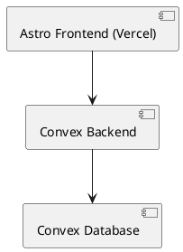
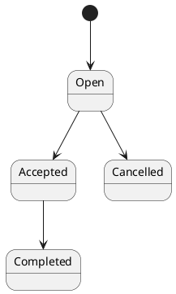

# SPEC-1-Trust Infrastructure for Neighbors

## Background

Urban environments are physically dense but socially fragmented, leading to underutilized local cooperation. Existing platforms optimize for engagement (social networks) or transactions (marketplaces), but fail to build persistent, structured trust between neighbors.

As a result, people rely more on strangers with platform-mediated trust than on nearby neighbors. The missing layer is not connectivity, but a system that captures and compounds trust through repeated successful interactions.

This project aims to create a web-based, hyperlocal “small favors network” where neighbors can request and fulfill help through an open feed. Each completed interaction contributes to a dynamic trust graph, enabling increasingly reliable and safe cooperation over time.

---

## Requirements

### Must Have (MVP-critical)

- Auth:
  - Email / magic link login

- User:
  - Approximate home location (stored precisely, exposed coarsely)

- Requests:
  - Create favor request (title, description)
  - Open nearby feed (geo-filtered)
  - Accept request (single helper)
  - Mark as completed
  - Cancel request

- Trust:
  - Simple trust score = number of completed favors

- System tracking:
  - requester_id, helper_id, timestamps, status

- Feed ranking:
  - By proximity

- Privacy:
  - Exact location hidden, rounded location exposed

### Should Have (early iteration)

- Chat between requester & helper
- User profile:
  - Completed favors count

- Simple post-completion feedback (👍 / 👎)

### Could Have

- Trust graph traversal (friends-of-trusted)
- Request categories
- Soft identity verification

### Won’t Have (MVP)

- Payments / marketplace
- AI matching
- Multi-helper requests
- Native mobile apps
- Notifications (email/push)

---

## Method

### High-Level Architecture



### Core Design Principles

1. Realtime-first UX using Convex subscriptions
2. Trust derived from interactions (not hardcoded)
3. Hybrid geo privacy model
4. Simple request lifecycle
5. Single helper constraint for MVP

---

### Request Lifecycle



---

### Database Schema

#### users

```ts
users: {
  _id: Id<"users">
  email: string
  name?: string

  lat: number
  lng: number

  trustScore: number

  createdAt: number
}
```

Indexes:

- by_email

---

#### requests

```ts
requests: {
  _id: Id<"requests">

  title: string
  description: string

  requesterId: Id<"users">
  helperId?: Id<"users">

  status: "open" | "accepted" | "completed" | "cancelled"

  lat: number
  lng: number

  createdAt: number
  acceptedAt?: number
  completedAt?: number
}
```

Indexes:

- by_status
- by_requester

---

#### interactions

```ts
interactions: {
  _id: Id<"interactions">;

  requesterId: Id<"users">;
  helperId: Id<"users">;

  requestId: Id<"requests">;

  outcome: "completed" | "failed";
  createdAt: number;
}
```

Indexes:

- by_requester
- by_helper
- by_pair

---

#### messages

```ts
messages: {
  _id: Id<"messages">;

  requestId: Id<"requests">;

  senderId: Id<"users">;
  body: string;

  createdAt: number;
}
```

Indexes:

- by_request

---

### Core Algorithms

#### Create Request

- Insert request with status = open

#### Accept Request (Race-safe)

- Ensure status is open
- Assign helper
- Transition to accepted

#### Complete Request

- Validate participants
- Update status to completed
- Insert interaction record
- Increment helper trust score

---

### Feed Query

1. Bounding box filter (~1km radius)
2. Filter status = open
3. Exclude own requests
4. Sort by distance ascending

Distance calculation via geolib

---

### Chat

- Scoped to requestId
- Only requester + helper allowed
- Realtime via Convex subscriptions

---

### Privacy Model

- Store exact lat/lng
- Expose rounded coordinates (~100m precision)

---

### Libraries / Tools

- Auth: Clerk or Lucia
- Geo: geolib
- Validation: zod
- State: nanostores
- Date handling: date-fns

---

## Implementation

### Phase 1: Setup

1. Initialize Astro project
2. Setup Convex backend
3. Configure deployment on Vercel
4. Integrate auth (Clerk or Lucia)

### Phase 2: Core Models

1. Define Convex schemas
2. Implement users, requests, interactions tables
3. Add indexes

### Phase 3: Core Features

1. Create request flow
2. Feed query with geo filtering
3. Accept request mutation
4. Complete request mutation
5. Cancel request mutation

### Phase 4: Trust System

1. Interaction logging
2. Trust score increment logic

### Phase 5: Chat (Should)

1. Messages table
2. Realtime chat UI

### Phase 6: Privacy Layer

1. Coordinate rounding before client exposure

### Phase 7: UI

1. Feed page
2. Request creation form
3. Request detail page
4. Chat interface

---

## Milestones

### Week 1

- Project setup
- Auth + user creation

### Week 2

- Request creation + feed

### Week 3

- Accept + complete flow
- Trust score

### Week 4

- Chat system
- UI polish

---

## Gathering Results

### Metrics

- Requests created per user
- Completion rate
- Average response time
- Repeat interactions between same users

### Success Criteria

- High completion rate (>60%)
- Users perform multiple favors
- Dense local interaction clusters emerge
